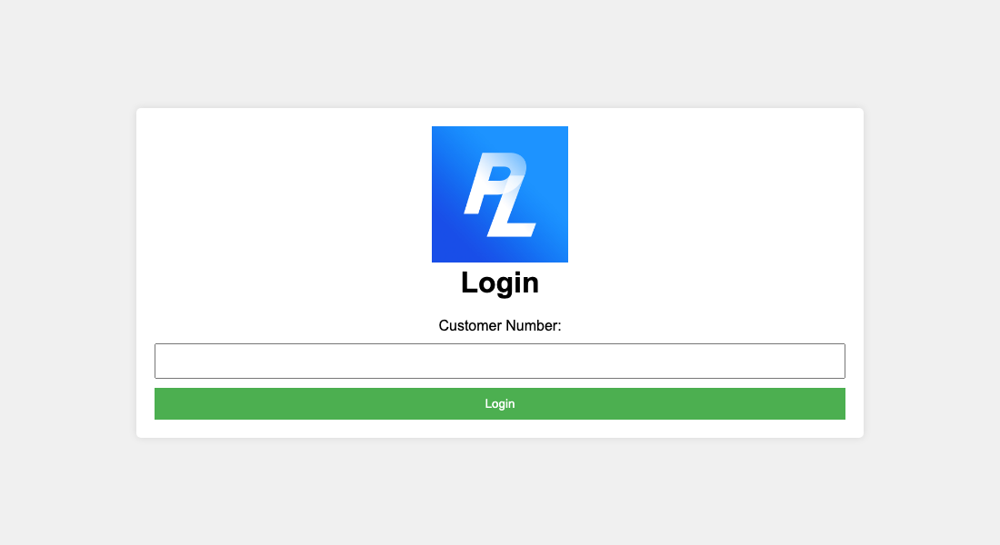
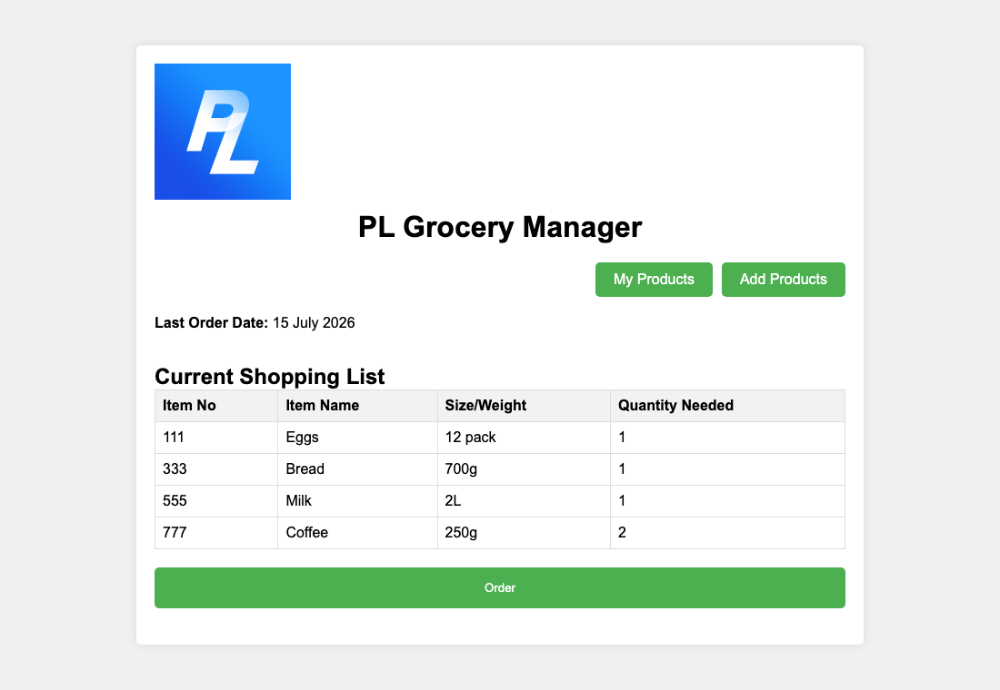
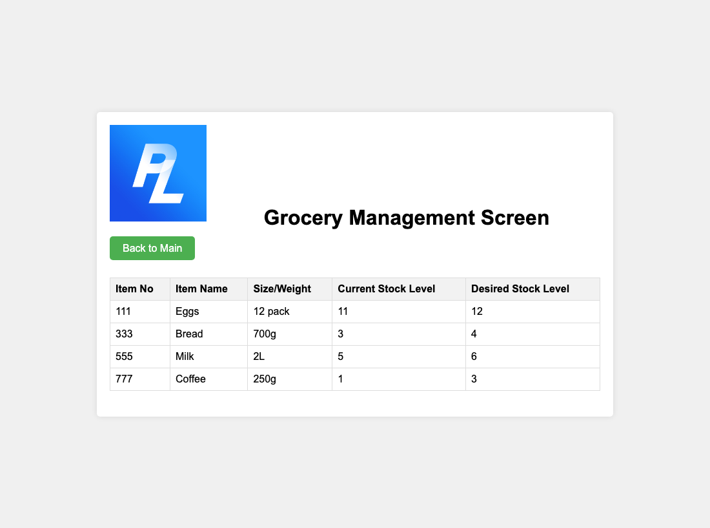
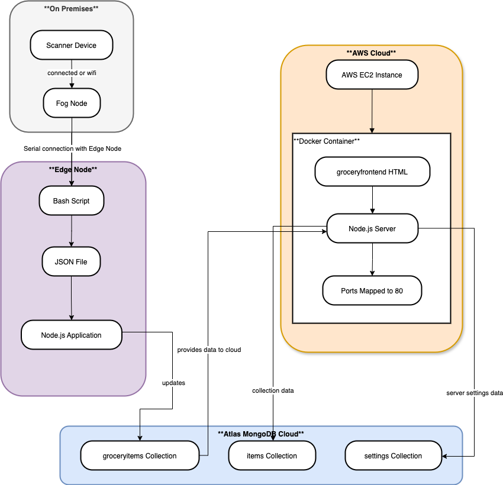

# Grocery Management System

[](https://github.com/daniel-p-allen/grocery-management-system/actions/workflows/ci.yml)

An IoT pantry-tracking prototype. A 4×4 keypad wired to an Arduino reports items as they
are used — each product has a 3-digit code — and the system records them in MongoDB,
tracks stock levels, and builds a shopping list when items run low.

Built as a university IoT project (2024). Currently being extended into a full hardware
prototype — see [Status](#status).

## Try it

```bash
docker compose up          # or: make demo
```

Then open <http://localhost:4000> and enter customer number `1234`.

No MongoDB account, no Arduino, no configuration. The database runs locally, the pantry is
seeded with four products and five scans, and the processing interval is dropped from a
minute to three seconds so a scan takes effect while you watch. Coffee starts below its
target stock, so the shopping list has something in it immediately.

`make demo-down` removes the containers and the database volume.

[System Architecture Document](System%20Architecture%20Document.pdf) ·
[Demo video](https://deakin.au.panopto.com/Panopto/Pages/Viewer.aspx?id=6ebda2a1-8227-4fca-a4cf-b1ef00b36d87)
(Deakin sign-in may be required)

## Screenshots

Taken from the compose stack above, so this is what `docker compose up` actually gives you.

| | |
|---|---|
|  |  |
| Customer number unlocks the system. | The shopping list, built from the gap between current and desired stock. Coffee has been used twice, so it needs two. |



Current against desired stock for every tracked product. These numbers started at the
desired level and fell as the seeded scans were processed.



## How it works

The system is four processes connected by a serial port, a JSON file, and a database:

| Stage | Component | What it does |
|---|---|---|
| 1. Enter | `src/arduinoGROCERYPROJ/arduinoGROCERYPROJ.ino` | Reads a 3-digit product code from the keypad, sends it over USB serial on `#`. |
| 2. Capture | `src/newserver/bashservice.sh` | Listens on the serial port, appends `{input, timestamp}` to `data.json`. |
| 3. Persist | `src/newserver/dbservice.js` | Reads `data.json`, inserts records into `grocerydb.groceryitems`. |
| 4. Serve | `src/groceryfrontend/frontserver.js` | Express app on port 4000. Serves the UI, and every 60s processes new scans into stock levels and order suggestions. |

`src/newserver/simulator.js` stands in for the Arduino, so the system can be run and
demonstrated without hardware attached.

The split exists because the scanner is physically tethered to one machine (the "fog node")
while the database and UI are cloud-side. Stages 1–2 run at the edge; stages 3–4 do not
care where the scan came from.

### Data model

MongoDB database `grocerydb`:

- `groceryitems` — raw scans from the Arduino, marked `processed` once consumed.
- `items` — the product catalogue and current stock levels.
- `settings` — application state, including `lastOrderDate`.

## Running it without Docker

The compose stack above is the quickest way in. Run the services directly when you want to
attach real hardware, or point the system at a MongoDB Atlas cluster.

### Prerequisites

- Node.js 18+
- A MongoDB Atlas cluster (or a local MongoDB)
- `jq` (used by `bashservice.sh`)
- Optional: an Arduino Uno with a 4×4 keypad, running the sketch in
  `src/arduinoGROCERYPROJ/`. Without one, use the simulator.

### 1. Configure

Both services read a `.env` file from their own directory. Create
`src/newserver/.env` and `src/groceryfrontend/.env`:

```
MONGO_URL=mongodb+srv://<user>:<password>@<cluster>.mongodb.net/grocerydb?retryWrites=true&w=majority
CUSTOMER_NUMBER=<the number used to unlock the UI>
PROCESS_INTERVAL_MS=60000
```

`CUSTOMER_NUMBER` and `PROCESS_INTERVAL_MS` are only needed by the frontend. `.env` files
are gitignored and must never be committed.

`PROCESS_INTERVAL_MS` sets how often new scans are turned into stock movements, and
defaults to one minute. That is a sensible pace for a pantry but a tedious one for a
demonstration, so lower it — `PROCESS_INTERVAL_MS=3000` makes the effect of a scan visible
almost immediately.

### 2. Seed the database

A fresh database has no product catalogue, so the UI would render an empty page. This adds
four products and the sample scans:

```bash
cd src/newserver
npm install
npm run seed       # or: make seed
```

Safe to run more than once. Skip it if you would rather add products by hand on the
update-stock page — but add them *before* scanning, or the scans are discarded (see
[Status](#status)).

### 3. Install and start the frontend

```bash
cd src/groceryfrontend
npm install
npm start          # http://localhost:4000
```

### 4. Feed it some scans

With hardware:

```bash
cd src/newserver
npm install
./bashservice.sh   # edit the serial port path inside first — see Known limitations
node dbservice.js  # pushes data.json into MongoDB
```

Without hardware, run the simulator instead of `bashservice.sh`:

```bash
cd src/newserver
npm install
node simulator.js
node dbservice.js
```

Open <http://localhost:4000>, enter the customer number, and the stock list will reflect
the scans.

## Tech stack

- **Hardware** — Elegoo Arduino Uno, 4×4 matrix keypad, USB serial
- **Edge** — Bash, `jq`
- **Backend** — Node.js, Express, MongoDB
- **Frontend** — server-rendered HTML/CSS (no framework)
- **Containers** — Docker and Docker Compose for the self-contained demo
- **CI** — GitHub Actions
- **Deployment** — ran on AWS during the 2024 project, not currently hosted
  (see [Status](#status))

## Repository layout

```
grocery-management-system/
├── src/
│   ├── arduinoGROCERYPROJ/     # Arduino sketch (C++)
│   ├── newserver/              # Edge capture, database and seed services
│   └── groceryfrontend/        # Express app and UI
├── scripts/
│   └── check-secrets.sh        # Refuses to ship committed credentials
├── tests/                      # Automated black-box test suite, plus the 2024 UI results
├── docker-compose.yml          # Self-contained demo: database, seed, UI
├── Makefile                    # demo, seed, start, simulate, test, check
├── System Architecture Document.pdf
├── grocery.drawio.png          # Architecture diagram
└── LICENSE.txt                 # MIT
```

## Tests

```bash
make test       # 56 automated tests, no setup required
```

No Docker, no Colima, no Atlas account, no `.env`. The tests supply their own MongoDB.

These are **black-box** tests. They do not import the application — they start it, as a
real process, exactly the way `npm start` does, and then drive it from the outside: over
HTTP for the web app, over stdin for the command-line tools. What they assert on is what
actually reached the database or the disk.

That was a deliberate choice. Testing the internals would have meant adding exports and
splitting files apart to create seams for the tests to reach through — reshaping the
application to suit its tests. Driving it from outside means **nothing under `src/` had to
change**, and what gets covered is the real system: the real Express routes, the real Mongo
driver, the real queries.

Several tests exist because a specific defect was found and fixed here. A fix without a
test is a fix that comes back:

| Test | The defect it holds shut |
|---|---|
| seeding twice does not reset stock that has moved | Seeding used `$set`, resetting every product to its starting quantity on the second run — a full pantry and an empty shopping list |
| the password is not leaked when the connection string is rejected | The connection string, which carries the database password, was once printed on startup |
| a missing `data.json` is created rather than hung on | The simulator hung on a clean checkout, so the first thing a new user tried appeared to freeze |
| no database URL is refused with an explanation, not a stack trace | Services crashed with a driver stack trace instead of saying what was missing |
| stock stops at zero rather than going negative | Negative stock reads as a shortfall forever |
| a scan for an unknown product is marked processed instead of retried forever | Otherwise the record is retried on every tick for the life of the process |
| stock levels are stored as numbers, not the strings a form posts | `"5"` stored as a string breaks the `$expr` comparison behind the shopping list, quietly |

**The suite is verified rather than assumed.** Each of those defects was reintroduced, one
at a time, in a scratch copy of the repository, and the matching test was confirmed to
fail. A suite that has only ever passed proves nothing.

[`tests/README.md`](tests/README.md) covers how to run them, how they work, and how to add
one.

## Repository checks

```bash
make check      # refuse to ship if a real credential is in the tree
```

This system holds three kinds of secret at once — a MongoDB password, cloud credentials and
a TLS key — and a scanner once flagged a connection string in `src/newserver/.env` before
this repository was published. Rather than rely on remembering, the repository checks
itself. `scripts/check-secrets.sh` fails the build if:

- a `.env`, `.pem`, `.key`, `.p12` or image tarball is tracked;
- a MongoDB URI carries credentials whose password is not a placeholder — a URI with no
  `user:password@`, such as the compose stack's `mongodb://mongo:27017/grocerydb`, holds
  no secret and is allowed;
- an AWS access key ID or a private key block is committed;
- the secret scanner's cache is left in the tree.

The checks are verified against planted fake credentials rather than assumed to work.

The same script runs in CI on every push and pull request, alongside checks that both
services install cleanly, all JavaScript and shell parses, the sample scan data has the
expected shape, and the services fail closed when no configuration is present. The test
suite runs there too, in a job of its own.

## Status

This is a **working prototype, not a product.** Known limitations, stated plainly:

- **There is no live deployment.** The system was containerised and run on AWS during the
  2024 project; that instance is gone and nothing here is currently hosted. Treat the AWS
  work as a past exercise, not a running service. The compose stack is the supported way to
  run it today.
- **The 2024 deployment artefacts are not recoverable.** The original `Dockerfile`, TLS key
  and image tarball were gitignored and are lost. The Dockerfiles in this repository were
  written in 2026 and are the ones the demo builds — they are not the images that ran on
  AWS, and they terminate TLS nowhere.
- **Scans are discarded if the product does not exist yet.** The processing loop marks a
  scan as processed whether or not a matching item is in the catalogue, so codes scanned
  before the product is added are consumed and lost. Add products on the update-stock page
  first, then scan.
- **The serial port path is hardcoded** to `/dev/cu.usbmodem146201` in `bashservice.sh`.
  It must be edited to match your machine.
- **`dbservice.js` is run manually** and prompts before clearing `data.json`; it is not a
  scheduled service.
- **Authentication is a single shared customer number**, not real user accounts.
- **The Arduino serial capture is not covered by the tests.** `bashservice.sh` and the
  sketch need the hardware on a port; everything downstream of them is tested.

## Development notes

The system was designed and built by me in 2024 as a university IoT project. The 2026
cleanup — the documentation, the secret-scanning check, the CI workflow, and fixes to the
configuration handling and simulator — was carried out with the assistance of an AI coding
assistant (Claude). The design, the architectural decisions, the scope of what to change and
what to preserve, and the review of all resulting work are my own.

## License

MIT — see [LICENSE.txt](LICENSE.txt).
